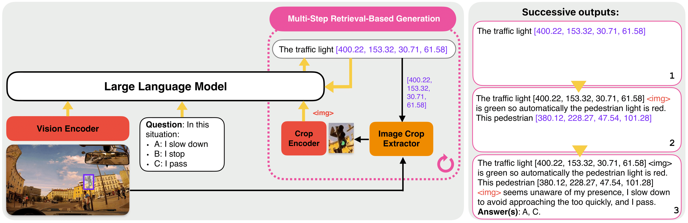

# RIV-CoT: Retrieval-Based Interleaved Visual Chain-of-Thought in Real-World Driving Scenarios

[](https://arxiv.org/abs/2501.04671)
[](https://huggingface.co/datasets/EPFL-DrivingVQA/DrivingVQA)
[](https://vita-epfl.github.io/DrivingVQA)



## Abstract

While chain-of-thought (CoT) prompting improves reasoning in large language models, its effectiveness in vision-language models (VLMs)
remains limited due to over-reliance on textual cues and pre-learned priors. To investigate the visual reasoning capabilities
of VLMs in complex real-world scenarios, we introduce DrivingVQA, a visual question answering dataset derived from driving theory
exams that contains 3,931 multiple-choice problems, alongside expert-written explanations and grounded entities relevant to the
reasoning process. Leveraging this dataset, we propose RIV-CoT, a retrieval-based interleaved visual chain-of-thought method that
enables VLMs to reason over visual crops of these relevant entities. Our experiments demonstrate that RIV-CoT improves answer
accuracy by 3.1% and reasoning accuracy by 4.6% over vanilla CoT prompting. Furthermore, we demonstrate that our method can
effectively scale to the larger A-OKVQA reasoning dataset by leveraging automatically generated pseudo-labels, once again
outperforming CoT prompting.

## DrivingVQA Dataset

The dataset is available on [HuggingFace Hub](https://huggingface.co/datasets/EPFL-DrivingVQA/DrivingVQA).

## Usage

#### Preprocessing

To train or evaluate the model on DrivingVQA or A-OKVQA, you need to create LLaVA format file for the given split (train, test) according
to the desired conversation format. Edit and run the following bash file:
```bash
bash scripts/preprocessing/convert_annotations.sh
````
If your conversation format relies on using visual patches (e.g., RIV-CoT, QP-RB-RV-EA, QPRV-EA), you need beforehand to extract visual patches of the entities
from images to be used in training. Edit and run the following bash file before running `convert_annotations.sh`:
```bash
bash scripts/preprocessing/extract_image_crops.sh
````

#### Training

Fine-tune the LLaVA-OneVision-7B model on the DrivingVQA or A-OKVQA dataset using the following bash file:
```bash
bash scripts/train/finetune.sh
````

#### Evaluation

- For RIV-CoT evaluation, edit the following bash file and run it:
  ```bash
  bash scripts/eval/eval_riv_cot.sh
  ````

- For two-step evaluation (QP-RB-RV-EA), edit and run the following bash file:
  ```bash
  bash scripts/eval/eval_two_step.sh
  ````

- For every other evaluation (QP-A, QP-EA, QP-REA, QP-RBEA, QP-IEA, QP-IBEA, QPR-EA, QPRV-EA),
edit the following bash file and run it:
  ```bash
  bash scripts/eval/eval_single_step.sh
  ````

#### Entity Pseudo Labelling

To generate interleaved pseudo relevant entities with labels and bounding boxes, edit and run the following bash files:
```bash
bash scripts/entity_pseudo_labelling/step1_preprocessing.sh
bash scripts/entity_pseudo_labelling/step2_entity_extraction.sh
bash scripts/entity_pseudo_labelling/step3_interleaved_generation.sh
````

#### Zero-shot Evaluation
To evaluate your model in zero-shot settings, add its configuration in `llava/eval/eval_zeroshot/py`, then edit and run the following bash file:
```bash
bash scripts/eval/eval_zeroshot.sh
````

## Results with LLaVA-Onevision-7B

| Training Strategy  | Ent. Name | Ent. BBox | Ent. Vis. | Interlvd. | Exam (%)         | F1-Score (%)     |
|--------------------|-----------|-----------|-----------|-----------|------------------|------------------|
| DirectAnswer       | ✓         |           |           |           | 53.0 (±0.9)      | 63.3 (±0.6)      |
| CoT                | ✓         |           |           |           | 56.2 (±1.0)      | 65.8 (±0.9)      |
| QP–REA             | ✓         | ✓         |           |           | 57.0 (±1.3)      | 67.1 (±1.4)      |
| QP–RBEA            | ✓         | ✓         |           | ✓         | 57.7 (±0.7)      | 67.3 (±0.7)      |
| QP–RB–RV–EA        | ✓         | ✓         | ✓         | ✓         | 58.4 (±1.1)      | 67.8 (±1.1)      |
| QP–IEA             | ✓         |           | ✓         | ✓         | 56.4 (±0.4)      | 66.3 (±0.6)      |
| QP–IBEA            | ✓         | ✓         | ✓         | ✓         | 57.9 (±0.5)      | 66.8 (±0.2)      |
| **RIV-CoT**        | ✓         | ✓         | ✓         | ✓         | **59.3 (±1.0)**  | **68.8 (±0.9)**  |


## Project Page

For more information, visualizations, and updates, visit the **[project page](https://vita-epfl.github.io/DrivingVQA/)**.

## Acknowledgments

- This codebased builds upon the [LLavA-NeXT](https://github.com/LLaVA-VL/LLaVA-NeXT) repository []
- We would like to thank  Max Luca Pio Conti, Pierre Ancey, Francesco Pettenon and Matthias Wyss for their contributions to preliminary work. 
- We  are grateful to Auguste Poiroux, Gaston Lenczner, Florent Forest, Jacques Everwyn, Vincent Montariol, Alice Legrand, Marc Lafon, Yannis Karmim,
and Alexandre Merkli for the human evaluation of the DrivingVQA test set. 
- We also thank the VITA lab members for their valuable feedback, which helped to enhance the quality of this manuscript. 
- SM gratefully acknowledges the support of the Swiss National Science Foundation (No. 224881). 
- AB gratefully acknowledges the support of the Swiss National Science
Foundation (No. 215390), Innosuisse (PFFS-21-29), the EPFL Center for Imaging, Sony Group Corporation,
and the Allen Institute for AI.

## Citation

If you use RIV-CoT or the DrivingVQA dataset in your research, please cite our paper:

```bibtex
@misc{drivingvqa2025,
  author        = {Corbière, Charles and Roburin, Simon and Montariol, Syrielle and Bosselut, Antoine and Alahi, Alexandre},
  title         = {Retrieval-Based Interleaved Visual Chain-of-Thought in Real-World Driving Scenarios},
  year          = {2025},
  eprint        = {2501.04671},
  archivePrefix = {arXiv},
  primaryClass  = {cs.CV}
}
```
